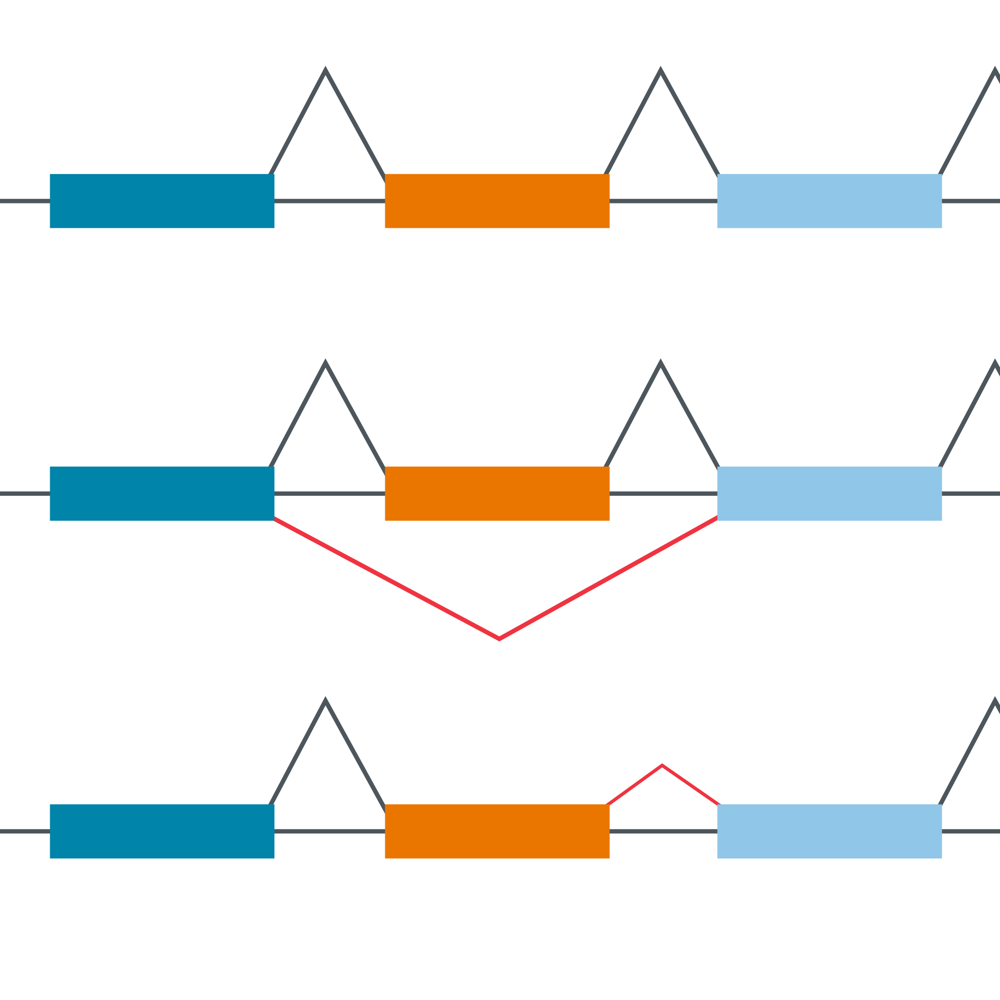

[![LinkedIn][linkedin-shield]][linkedin-url]

<!-- PROJECT LOGO -->
 

  
  <h3 align="center"> RNAseq STAR alignment optimisation using splice junction inputs</h3>

  

    Investigating the effects of different splice junction filtering strategies on alignment results
     

<!-- TABLE OF CONTENTS -->

  
Table of Contents

  <ol>
    <li>
      <a href="#about-the-project">About The Project</a>
    <li>
      <a href="#results">Results</a>
    </li>
    <li><a href="#contact">Contact</a></li>
    <li><a href="#acknowledgments">Acknowledgments</a></li>
  </ol>

<!-- ABOUT THE PROJECT -->
## About The Project

The GENCODE Hg38 reference genome was primarily built on caucasian genomes, as a group who works with samples of Asian decent, we set out to investigate the benefits of running 2 pass STAR alignment. The resulting list of splice junctions detected from the first pass were inserted into the list of reference gene transcripts with the intention of improving detection of incoming RNA transcripts from raw Illumina reads. 

The generated list of splice junctions during the first pass of STAR may generate erroneous splice junctions as it is based on algorithmic predictions and potential inaccuracies from raw RNAseq. This list was filtered with the intention of improving alignment and gene detection accuracy as well as reducing total alignment run times. 

Criterion based strategies involve filtering splice junctions based on support for a given splice junction - occurence across reads input within samples and across samples in a batch - and alignment specific metrics like spliced overhang. A more detailed explanation can be found in the [splice junction filtering notebook](splice_junction_filtering.ipynb)

Another filtering strategy we tested was a machine learning based filtering approach [Portcullis](https://github.com/EI-CoreBioinformatics/portcullis) which trains a random-forest model based on alignment metrics using a .bam file as input to generate a filtered list of splice junctions.

The different filtering techniques were applied on RNAseq data from different tissue types, across cell-line and tumour tissue samples.

(<a href="#readme-top">back to top</a>)

## Results

There was a marginal improvement in uniquely mapped reads when aligned using the list of criterion filtered splice junctions, and a marked drop in unique mappers when applying the Portcullis filtering method.
[![Uniquely mapped][uniquely-mapped]](placeholder.com)

The most notable difference in run times was between the raw unfiltered list and the filtered list. Run times are presumably correlated to the total length or number of splice junctions in the given list. 
[![Total Duration][total-duration]](placeholder.com)

The conclusion of the investigation was that the best balance between run times and accuracy was found in the criterion based filtering technique. This was then finalised as the optimum strategy for our RNAseq preprocessing pipeline.

(<a href="#readme-top">back to top</a>)

<!-- CONTACT -->
## Contact

Kenneth Chow - kennethchowsk@gmail.com

Project Link: [https://github.com/kennethchow/rnaseq-sj-optimisation](https://github.com/kennethchow/rnaseq-sj-optimisation)

(<a href="#readme-top">back to top</a>)

<!-- ACKNOWLEDGMENTS -->
## Acknowledgments

* [STAR](https://github.com/alexdobin/STAR)
* [Portcullis](https://github.com/EI-CoreBioinformatics/portcullis)

(<a href="#readme-top">back to top</a>)

<!-- MARKDOWN LINKS & IMAGES -->

[linkedin-shield]: https://img.shields.io/badge/-LinkedIn-black.svg?style=for-the-badge&logo=linkedin&colorB=555
[linkedin-url]: https://linkedin.com/in/kenneth-chow
[total-duration]: images/total_duration.png
[uniquely-mapped]: images/uniquely_mapped.png